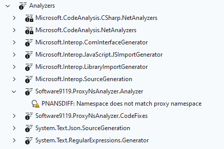
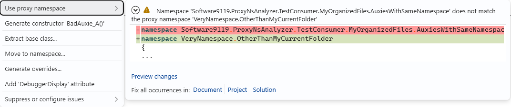
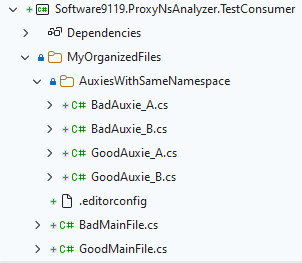

# Software9119.ProxyNsAnalyzer

`ProxyNsAnalyzer` is a C# code analyzer shipped with one rule and purpose only. It allows in conjunction with `.editorconfig` to define proxy
namespace that is then expected by analyzer in `.cs` files in scope of `.editorconfig` in question.

The rule is `PNANSDIFF`, _"Namespace does not match proxy namespace"_ and comes with default _warning_ priority.



Proxy namespace is declared in `.editorconfig` file using `proxy_namespace` key, e.g.

```editorconfig
[*.cs]

# namespace override
proxy_namespace = MyCompany.OurProduct.FancyNamespace
```

Likely you will want to configure `IDE0130: Namespace does not match folder structure` rule as `PNANSDIFF` is exclusive to it. Have look in [sample](./sample/.editorconfig) for details.

You are enabled to fix namespace to proxy by code fix option _'Use proxy namespace'_.

 

Note scope-fix options: document, project and solution.

## Guide

> Tell me and I forget, teach me and I may remember, involve me and I learn.

Take a look at folder structure

```
MySolution
  └───MyFeature
      ├───TopLogic.cs
      ├───HeavyLogic.cs
      └───MyAuxies
          ├───AuxA.cs
          ├───AuxB.cs
          ├───AuxC.cs
          └───AuxD.cs
```

So, you made it to maintain high level of file organization yet you do not want to introduce some _'obscure'_ namespace into solution.
On other hand you want to be sure your foldered files have unfoldered namespace.

Then, install Software9119.ProxyNsAnalyzer and set up `.editorconfig` and place it into `./MySolution/MyFeature/MyAuxies`.

```editorconfig
[*.cs]

# namespace override
proxy_namespace = MySolution.MyFeature

# IDE0130: Namespace does not match folder structure
dotnet_diagnostic.IDE0130.severity = none
```

### Sample

Having: structure below, `proxy_namespace = VeryNamespace.OtherThanMyCurrentFolder` set in `.\MyOrganizedFiles\.editorconfig`, `Good*` files already obidient to proxy namespace
and `Bad*` files not, analyzer will produce warnings.




|     Severity     |   Code    |                     Description                      |                  Project                  |                                                                            File                    | Line |
|------------------|-----------|------------------------------------------------------|-------------------------------------------|----------------------------------------------------------------------------------------------------|------|
| Warning (active) | PNANSDIFF | When proxy namespace declared, it should be applied. | Software9119.ProxyNsAnalyzer.TestConsumer | …\Software9119.ProxyNsAnalyzer.TestConsumer\MyOrganizedFiles\AuxiesWithSameNamespace\BadAuxie_A.cs |    1 |
| Warning (active) | PNANSDIFF | When proxy namespace declared, it should be applied. | Software9119.ProxyNsAnalyzer.TestConsumer | …\Software9119.ProxyNsAnalyzer.TestConsumer\MyOrganizedFiles\AuxiesWithSameNamespace\BadAuxie_B.cs |    1 |
| Warning (active) | PNANSDIFF | When proxy namespace declared, it should be applied. | Software9119.ProxyNsAnalyzer.TestConsumer | …\Software9119.ProxyNsAnalyzer.TestConsumer\MyOrganizedFiles\BadMainFile.cs                        |    1 |

